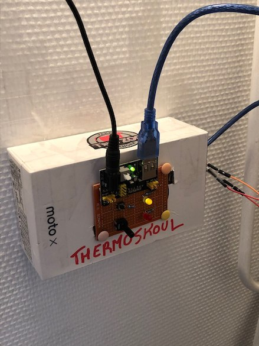
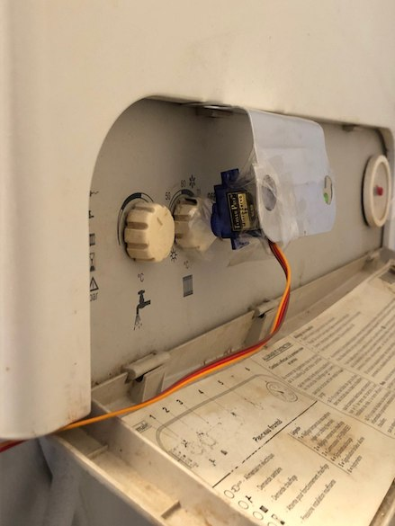
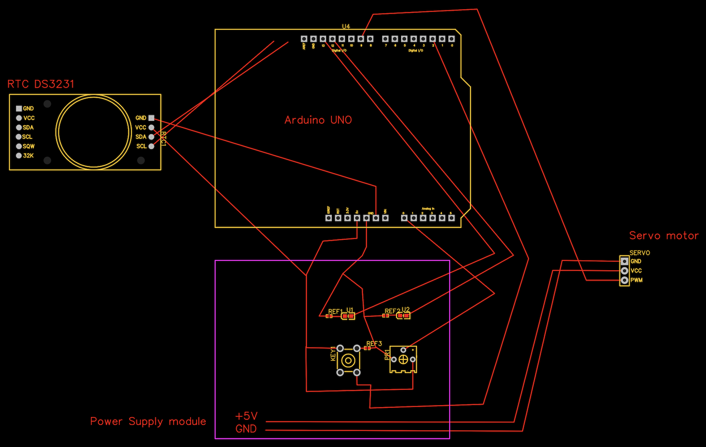

# Thermoskoul

I was annoyed by the noise of my apartment boiler to fall asleep, but I wanted
to find my shower towels hot every morning. So I made this electronic system to
turn off and on my boiler on specific hours.

## Hardware

- Arduino UNO R3
- RTC DS3231
- Micro Servo SG90
- MB102 Power Supply

## Final system

 

## Rough sketch

